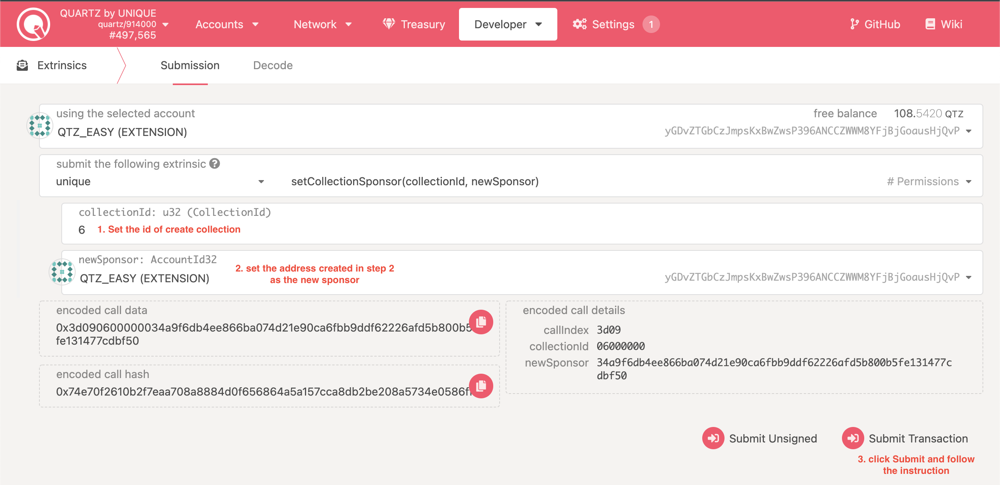

# Unique EVM Marketplace Deployment

Who is this document for:

- Full stack engineers
- IT administrators

In this tutorial we will install the marketplace locally on a computer or in a virtual machine with Ubuntu OS. The process of installing it in a production environment is identical but will require additional steps needed to set up the supporting infrastructure that allows for on-line access on the interweb (a domain name, hosting, firewall, nginx, and the corresponding SSL certificates). See Unique marketplace as am example in this regard: [https://unqnft.io](https://unqnft.io).


## Prerequisites

- OS: Ubuntu 18.04 or 20.04
- docker CE 20.10 or up
- docker-compose 1.25 or up
- git
- Google Chrome Browser

## Step 1 - Install Polkadot{.js} Extension

Visit [https://polkadot.js.org/extension/](https://polkadot.js.org/extension/) and click on the “Download for Chrome” button. Chrome browser will guide you through the rest of the process.


Upon completing the installation successfully you should see the appropriate browser extension icon in the top right corner:


## Step 2 - Create Admin Address

Click on the Polkadot{.js} extension icon and select “create new account” in the menu:


Take care to write down the 12-word mnemonic seed on a piece of paper. Do not share it with anybody as this 12-word phrase is all that’s needed to obtain access to the assets stored in this account.

Follow the Polkadot{.js} instructions to complete the account setup.

## Step 3 - Get QTZ

In order to get the marketplace running, you’ll need some QTZ tokens. Now you can buy them on [MEXC Global](https://www.mexc.com/exchange/QTZ_USDT).

## Step 4 - Clone Marketplace Code From GitHub

Open the terminal and execute the following commands. This will clone both the backend and the frontend of the marketplace.

```
git clone https://github.com/UniqueNetwork/unique_evm_marketplace -b qtz_network
cd ./unique_evm_marketplace
git clone https://github.com/UniqueNetwork/unique-marketplace-api -b release/v1.0
git clone https://github.com/UniqueNetwork/unique-marketplace -b feature/easy-start-dev-server-env-configuration
```

## Step 5 - Deploy Marketplace Smart Contract

The `unique-marketplace-api` project already contains the code of the smart contract, if you wish, you can explore it here – https://github.com/UniqueNetwork/unique-marketplace-api/tree/release/v1.0/blockchain

We also provide a special utility that is the easiest way to deploy your smart contract. 

1. From inside the `root directory` create `docker-compose.yml` and copy the content of the `docker-compose.example.yml` there.
2. Change `ESCROW_SEED` to the 12-word admin mnemonic seed phrase that you have saved when you created the admin address in Polkadot{.js} extension.
3. Run following script.
```
docker-compose up -d --build marketplace-api
docker exec marketplace-api node dist/cli.js playground migrate_db
docker exec marketplace-api node dist/cli.js playground deploy_contract
```

After a short interval you should get an operational summary output in the terminal:

```
...

SUMMARY:

CONTRACT_ETH_OWNER_SEED: '0x6d853337ab45b20aa5231c33979330e2806465fb4ab...'
CONTRACT_ADDRESS: '0x74C2d83b868f7E7B7C02B7D0b87C3532a06f392c'
```

Set the values above to the corresponding variables of `docker-compose.yml`.

## Step 6 - Create Sponsored Collection

You may create collection for your marketplace using [Minter](https://minter-quartz.unique.network). When you create your collection you may find `collection id`


For now, EVM Marketplace can only work with sponsored collections. You may set sponsorship using [polkadot.js.org/apps](https://polkadot.js.org/apps/?rpc=wss%3A%2F%2Fquartz.unique.network#/extrinsics) in 3 steps:

### 1. Set Collection Sponsor

- Choose `unique` - `setCollectionSponsor`
- Set the collectionId parameter to the id of the previously created collection
- Set the admin address created in step 2 as the new sponsor
- Click `Submit Transaction` and follow the instructions



### 2. Confirm Sponsorship

- Choose `unique` - `confirmSponsorship`
- Set the admin address created in step 2 as the transaction sender
- Set the collectionId parameter to the id of the previously created collection
- Click `Submit Transaction` and follow the instructions


### 3. Transfer QTZ to Sponsor

To sponsor EVM calls, you will need to transfer some QTZ to the ethereum mirror of your collection sponsor.

Use a built-in utility to get this address. For the script below, change `<COLLECTION_SPONSOR>` to the admin address from the Step 2, and run it.
```
docker exec -ti marketplace-api node sub_to_eth.js <COLLECTION_SPONSOR>
```

The result will look like this:

```
Substrate address: 5EC3pKTxGj8ciFp37giawUY1B4aWTAU7aRRK8eA1J8SKNRsf
Substrate address balance: 9748981663000000000000
Ethereum mirror: 0x5e125Fd6aA7D06dEEd31475BcE293999a48015B0
Ethereum mirror balance: 0
Substrate mirror of ethereum mirror: 5C9rxShqs4vA3dxvesNUfPHRinWfwSeQAkHmaWbVzki84g1y
Substrate mirror of ethereum mirror balance: 0
```

Copy the `Substrate mirror of ethereum mirror` address and send some QTZ there. Now all ethereum transactions will be sponsored from this address.

## Step 7 - Configure Marketplace

Continue configuring the marketplace in `docker-compose.yml`

1. Set the collections IDs created in step 6 to `UNIQUE_COLLECTION_IDS`
2. Change `ESCROW_ADDRESS` to the Admin address created in step 2

## Step 8 - Build and Run

Execute the following command in the terminal and wait for it to complete:

```
docker-compose up -d --build
```

## Step 9 - Enjoy

Open [localhost:3000](http://localhost:3000) in your Chrome browser. On the first launch you will see the Polkadot{.js}’s request to authorize the website, click “Yes”:


The marketplace will connect to the blockchain and the local backend and will display the empty Market page. It is now ready to rumble.


